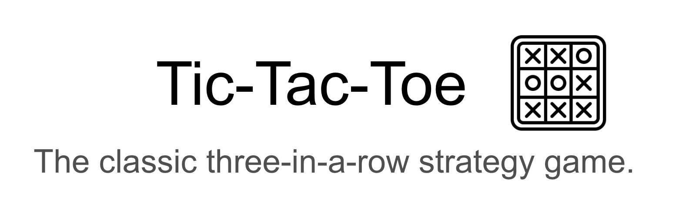

# Tic-Tac-Toe Game

A classic two-player strategy game using python loops and arrays. 
Part of the personal portfolio on the 100 Days of Code: The Complete Python Pro Bootcamp on Udemy, this 100% python game uses while loops, if statements and arrays to replicate the game usually played with pen and paper. 
## Game Play

The game of Tic-tac-Toe requires two players to mark a three-by-three grid with X or O. The winner is determined by who has three of their markers in a horizontal, vertical or diagonal row. 

Each player is prompted to select a number from 1-9 which corresponds to a space in the grid. If a space is occupied or not a number, it will prompt for the correct response. 

To win, the player must have three of their markers in either horizontal, vertical or diagonal positions. A tie is achieved when the board is full and no markers are in a row. 
## Getting Started

At present, there is only a two-player version in this repository. 
Please clone the repository and run the main.py from the terminal to begin play. 
## Pending Improvements

I hope to make further amendments in the form of a web or tkinter version. 

